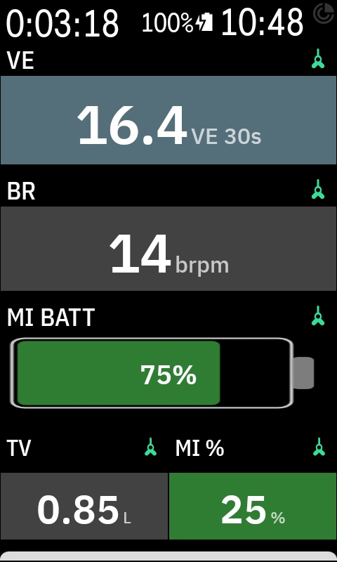

# K-Breathe

A Karoo extension that connects to the [Tymewear VitalPro](https://www.tymewear.com/) breathing sensor, displaying live breathing metrics and recording them to FIT files.

I really like coffee, so if this enhances your life, please buy me one :)

[](https://ko-fi.com/jeastwood)

## Screenshots

<p align="center">
  
  
</p>

## Data Fields

| Field | Description |
|-------|-------------|
| **VE** | Minute ventilation (L/min) with zone-colored background. Tap to cycle smoothing: Instant / 15s / 30s |
| **VE Graph** | Rolling VE graph with ventilation zone background bands |
| **BR** | Breathing rate (breaths/min) |
| **TV** | Tidal volume per breath (L) |
| **MI %** | Mobilization Index — ratio of breathing reserve to heart rate reserve. 100% = fully mobilized (limit) |
| **MI Batt** | Mobilization Index as a battery gauge — shows remaining reserve, 0% = empty |
| **VE Zones** | Time-in-zone bar chart (5 zones, matching Karoo's built-in HR/Power zone style) |

## Ventilation Zones

Five zones based on ventilation thresholds:

| Zone | Name | Default VE (L/min) | Color |
|------|------|---------------------|-------|
| Z1 | Endurance | < 83 | Teal |
| Z2 | VT1 | 83 - 111 | Blue |
| Z3 | VT2 | 111 - 128 | Amber |
| Z4 | Top Z4 | 128 - 180 | Orange |
| Z5 | VO2Max | > 180 | Red |

Zone thresholds are configurable via SharedPreferences.

## FIT Recording

All breathing data is recorded to FIT files as developer fields during rides:

- `tyme_breath_rate` (brpm)
- `tyme_tidal_volume` (vol/br)
- `tyme_minute_volume` (vol/min)
- `tyme_inhale_exhale_ratio` (sec/sec)
- `tyme_ve_zone`
- `tyme_mobilization_index` (%)
- `tyme_percent_brr` (%)

Session summary includes time and percentage spent in each VE zone. FIT files are compatible with the [Tymewear Dashboard](https://dashboard.tymewear.com/).

## Installation

### Prerequisites

- Karoo 3 cycling computer
- Tymewear VitalPro breathing sensor

### Option 1: Companion App (recommended)

1. On your phone, open the [latest release](https://github.com/gloscherrybomb/k-breathe/releases) in your browser
2. Long-press the `k-breathe.apk` link and share it with the **Hammerhead Companion** app
3. The Karoo will show an install prompt — tap **Install**
4. Open the K-Breathe app once to grant Bluetooth permissions
5. Future updates can be installed from the app details page on the Karoo

### Option 2: ADB

```bash
adb install -r k-breathe.apk
adb shell pm grant com.tymewear.karoo android.permission.BLUETOOTH_SCAN
adb shell pm grant com.tymewear.karoo android.permission.BLUETOOTH_CONNECT
adb shell pm grant com.tymewear.karoo android.permission.ACCESS_FINE_LOCATION
```

### Pair the Sensor

1. On the Karoo, go to **Profiles** > **Data Pages** > **Add Data Field**
2. Select any K-Breathe field (e.g. VE, BR) from the **Extensions** list
3. The Karoo will prompt you to pair the sensor — the VitalPro strap appears as `TYME-XXXX`
4. **Important:** Add the sensor from the Extensions list, not the Bluetooth settings

## Building from Source

Requires Java 21 and Android SDK.

```bash
./gradlew assembleRelease
```

The APK is output to `app/build/outputs/apk/release/k-breathe.apk`.

### Dependencies

- [karoo-ext SDK](https://github.com/hammerheadnav/karoo-ext) v1.1.8
- Kotlin 2.0.0
- Android Gradle Plugin 8.2.2

## License

MIT
