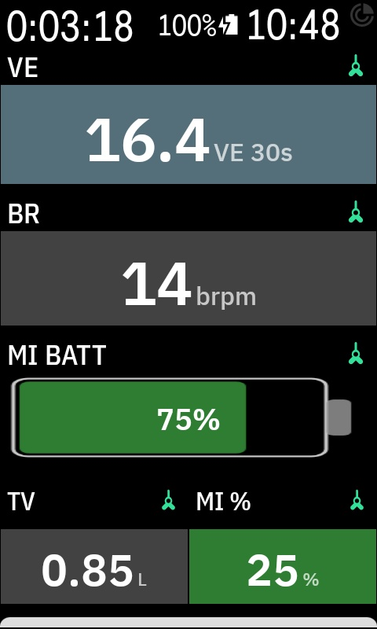
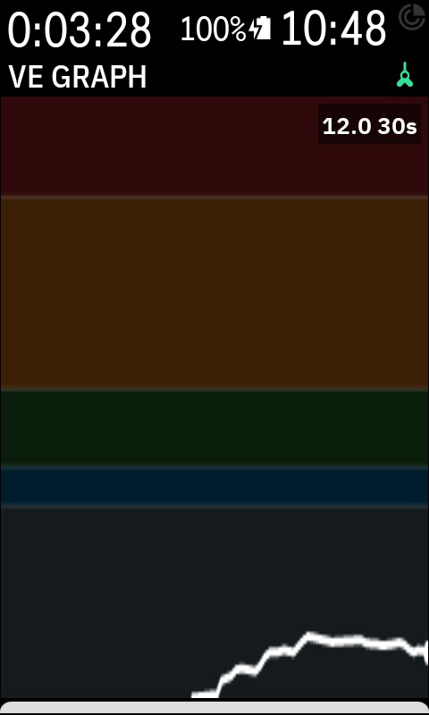

# K-Breathe

A Karoo extension that connects to the [Tymewear VitalPro](https://www.tymewear.com/) breathing sensor, displaying live breathing metrics and recording them to FIT files.

I really like coffee, so if this enhances your life, please buy me one :)

[](https://ko-fi.com/jeastwood)

## Screenshots

<p align="center">
  
  
</p>

## Data Fields

| Field | Description |
|-------|-------------|
| **VE** | Minute ventilation (L/min) with zone-colored background. Tap to cycle smoothing: Instant / 15s / 30s |
| **VE Graph** | Rolling VE graph with ventilation zone background bands |
| **BR** | Breathing rate (breaths/min) |
| **TV** | Tidal volume per breath (L) |
| **MI %** | Mobilization Index — ratio of breathing reserve to heart rate reserve. 100% = fully mobilized (limit) |
| **MI Batt** | Mobilization Index as a battery gauge — shows remaining reserve, 0% = empty |
| **VE Zones** | Time-in-zone bar chart (5 zones, matching Karoo's built-in HR/Power zone style) |
| **Vent State** | Today's day quality vs your own normal, and today's strap scale (Beta) |
| **Power + VE zone** | 3-second power, with a top-edge strip coloured by your current ventilation zone |

## Ventilation Zones

Five zones, bounded by your own ventilatory thresholds:

| Zone | Name | Range | Color |
|------|------|-------|-------|
| Z1 | Endurance | below VT1 | Teal |
| Z2 | VT1 | VT1 – VT2 | Blue |
| Z3 | VT2 | VT2 – Top Z4 | Amber |
| Z4 | Top Z4 | Top Z4 – VO2max | Orange |
| Z5 | VO2Max | above VO2max | Red |

**Set your own thresholds before relying on the zones.** Ventilation is highly
individual — the VE at which you cross VT1 depends on your physiology, not on a
number that suits everyone. The app ships with placeholder values purely so the
fields render something on first run; they are not a recommendation.

Get your values from a [Tymewear threshold test](https://www.tymewear.com/blogs/startup-guides/threshold-test),
then enter them under **Ventilation Zone Thresholds** in the K-Breathe app
(VT1, VT2, Top Z4, VO2max, in L/min). Thresholds drift with fitness, so retest
periodically — Tymewear suggest every 6–8 weeks.

## Ventilatory State (Beta)

Ventilatory thresholds move day to day with fatigue, heat, sleep and freshness — and the
VitalPro strap itself doesn't always sit exactly the same from ride to ride, so a
slightly looser or tighter fit can read a bit high or low too. A fixed zone table asserts
one number every day and can't tell any of that apart.

With a power meter **and** heart rate both paired, K-Breathe learns two baselines from
steady riding: how much you normally breathe at a given power, and at a given heart
rate. Comparing the two separates a change in the strap's reading from a change in you:

- **Strap scale** — how far off today's strap reading is from normal, shown as e.g.
  `×0.80`.
- **Day quality** — today's breathing against your normal for the same power, *after*
  the strap scale is removed. Negative means less breathing for the same effort — a
  good sign; positive means more.

Recorded VE, breathing rate and tidal volume are never touched by this — only the zone
colours, the VE Graph bands, the VE Zones bars, the **Power + VE zone** strip, the
recorded per-second `tyme_ve_zone` (and the session time-in-zone fields it feeds) and
the day-quality number.

It needs no threshold test: the baselines build themselves. From your third ride
onward, K-Breathe usually pins down today's strap scale within the first 40 minutes of
recording — typically around 10 minutes into a steady trainer ride, longer (commonly
around half an hour) on a ragged, stop-start outdoor ride, and sometimes not at all on a
ride that's too short or too ragged, in which case the ride just runs on your configured
thresholds throughout. Once it locks, it holds for the rest of the ride, and the zone
colours, VE Graph, VE Zones chart and the recorded `tyme_ve_zone` all switch to today's
corrected thresholds.

The **Vent State** field shows both numbers: day quality as the large figure, strap
scale on the small line underneath — or `learning` before it locks, `scale n/a` if a
reading falls outside a sane range (check the strap), or `off` when the Beta is
disabled.

The **Power + VE zone** field shows 3-second power with a coloured strip along the top
edge for your current ventilation zone — handy if your main screen is built around power
rather than VE. It works whether the Beta is on or off, and the strip turns grey when
breathing data is stale or the strap is disconnected.

Enable it under **Ventilatory State (Beta)** in the app. The settings section also shows:

- Baseline status for both baselines (how much has been learned, and from how many
  rides) — "calibrating" until there's enough.
- The last ride's strap scale, with a "check strap tension and position" hint when it
  was 10% or more off normal.
- A **threshold suggestion card** for VT1 or VT2 when the last few rides agree and
  differ meaningfully from what's configured, with one-tap **Apply** / **Dismiss**, an
  **auto-apply** switch (off by default) to apply suggestions automatically, and a
  change history with one-tap **Revert**. When a ride ends with a new suggestion, the
  Karoo shows it there and then with **Apply** / **Dismiss** / **Later** — **Later**
  leaves it waiting in settings.
- A **Reset baseline** button that discards everything learned so far and starts
  calibration over — use it after illness, a bike fit change, or a long break.

**Requires a power meter and heart rate.** Without both, no scale can be estimated and
the Beta fields report unavailable. Upgrading from an earlier version discards any old
baseline and starts calibration fresh, since it's built from a different sampler.

## FIT Recording

All breathing data is recorded to FIT files as developer fields during rides:

- `tyme_breath_rate` (brpm)
- `tyme_tidal_volume` (vol/br)
- `tyme_minute_volume` (vol/min)
- `tyme_inhale_exhale_ratio` (sec/sec)
- `tyme_ve_zone`
- `tyme_mobilization_index` (%)
- `tyme_percent_brr` (%)

Session summary includes time and percentage spent in each VE zone, plus:

- `tyme_ve_scale` — today's strap scale factor (Beta, session)
- `tyme_day_quality` — today's breathing vs. your normal after scale correction, % (Beta, session)

FIT files are compatible with the [Tymewear Dashboard](https://dashboard.tymewear.com/).

## Installation

### Prerequisites

- Karoo 2 or Karoo 3 cycling computer
- Tymewear VitalPro breathing sensor

### Karoo 3 installation

#### Option 1: Companion App (recommended)

1. On your phone, open the [latest release](https://github.com/gloscherrybomb/k-breathe/releases) in your browser
2. Long-press the `k-breathe.apk` link and share it with the **Hammerhead Companion** app
3. The Karoo will show an install prompt — tap **Install**
4. Open the K-Breathe app once to grant Bluetooth permissions
5. Future updates can be installed from the app details page on the Karoo

#### Option 2: ADB

```bash
adb install -r k-breathe.apk
adb shell pm grant com.tymewear.karoo android.permission.BLUETOOTH_SCAN
adb shell pm grant com.tymewear.karoo android.permission.BLUETOOTH_CONNECT
adb shell pm grant com.tymewear.karoo android.permission.ACCESS_FINE_LOCATION
```

#### Pair the Sensor

1. On the Karoo, go to **Sensors**, tap **+**, then across the top tap **Extensions** and pick
   Tymewear — the VitalPro strap appears as `TYME-XXXX`.
2. Then add K-Breathe fields to a data page: **Profiles** > **Data Pages** > **Add Data Field**,
   and pick them from the **Extensions** list.
3. **Important:** pair the sensor through the Extensions entry in the Sensors menu, not through
   the Karoo's Bluetooth settings.

Adding a data field first may also prompt you to pair, but several users have reported no prompt
appearing, so the Sensors-menu route above is the reliable one.

### Karoo 2 installation

The Karoo Companion app does not support the Karoo 2, and K-Breathe does not yet appear in
the Karoo 2's **Extensions** store, so the app needs to be sideloaded via ADB.

For easy-to-follow instructions for both Mac and Windows, see DC Rainmaker's article
[How to Sideload Android Apps On Your Hammerhead Karoo 1/2/3](https://www.dcrainmaker.com/2021/02/how-to-sideload-android-apps-on-your-hammerhead-karoo-1-karoo-2.html).

#### ADB installation

Download the latest `k-breathe.apk` from the [releases page](https://github.com/gloscherrybomb/k-breathe/releases).

```bash
adb install -r k-breathe.apk
adb shell pm grant com.tymewear.karoo android.permission.ACCESS_FINE_LOCATION
```

The Karoo 2 runs an older Android release in which the `BLUETOOTH_SCAN` and `BLUETOOTH_CONNECT`
permissions do not exist, so they cannot (and need not) be granted. K-Breathe runs fine without them.

#### Pair the Sensor

1. On the Karoo, go to **Sensors**.
2. Tap **+**, then across the top tap **Extensions** and pick Tymewear.

## Building from Source

Requires Java 21 and Android SDK.

```bash
./gradlew assembleRelease
```

The APK is output to `app/build/outputs/apk/release/k-breathe.apk`.

### Dependencies

- [karoo-ext SDK](https://github.com/hammerheadnav/karoo-ext) v1.1.8
- Kotlin 2.0.0
- Android Gradle Plugin 8.2.2

## License

MIT
